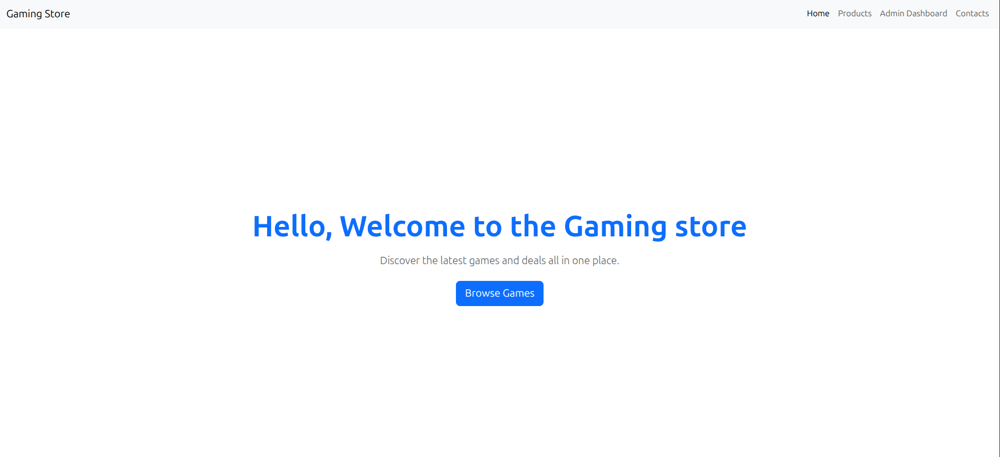
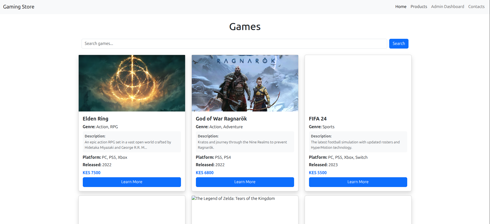
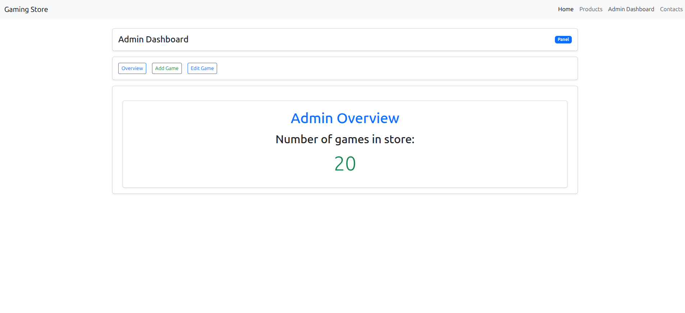
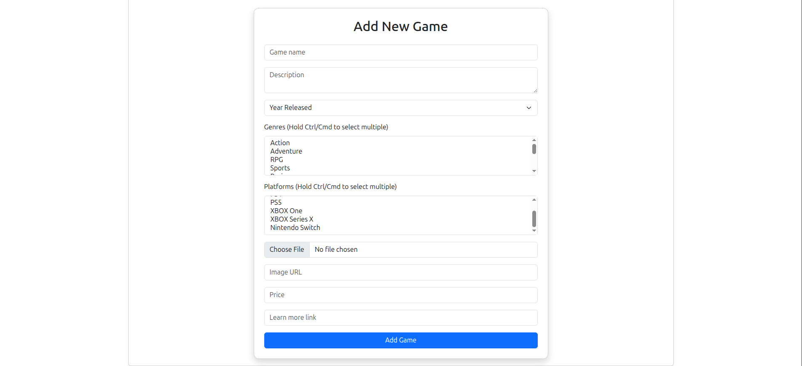
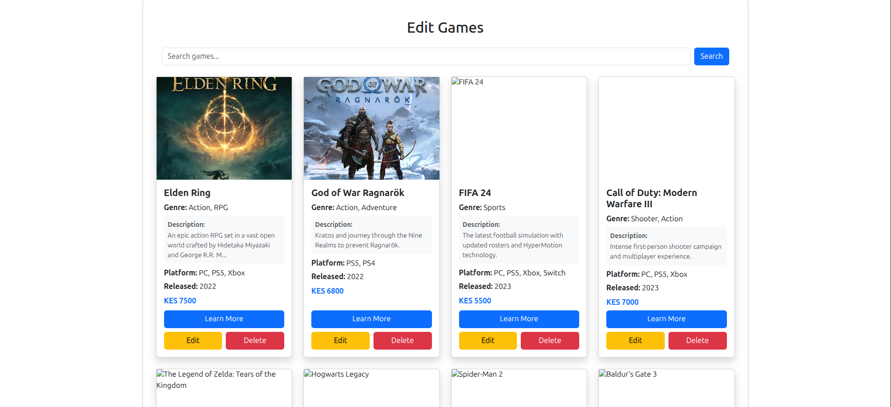
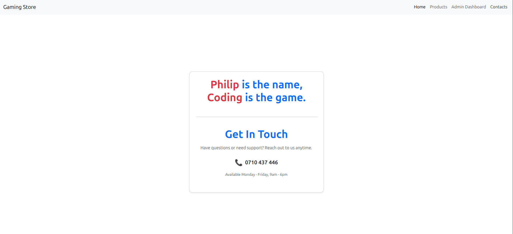

# 🎮 Game Store

A React-based web application for managing a video game store inventory. Built as part of Module 3 (React) coursework.

## Features

- **Browse Games** — View all games with search functionality
- **Admin Panel** — Add, edit, and delete games
- **Responsive Design** — Works on desktop and mobile
- **Form Validation** — Multi-select genres and platforms
- **Real-time Search** — Filter games by name instantly

## Tech Stack

- React 18
- React Router DOM
- Bootstrap 5
- JSON Server (mock database)
- Vite

## Getting Started

### Prerequisites

- Node.js installed
- npm or yarn

### Installation

1. Clone the repository

   ```bash
   git clone https://github.com/mainamuchiru/game-store-project.git
   cd game-store-manager
   ```

2. Install dependencies

   ```bash
   npm install
   ```

3. Install Bootstrap (if not already installed)

   ```bash
   npm install bootstrap
   ```

   Then import it in your `main.jsx`:

   ```jsx
   import 'bootstrap/dist/css/bootstrap.min.css';
   ```

4. Start the mock API server

   ```bash
   npx json-server --watch db.json --port 3000
   ```

5. Start the React app (in a new terminal)

   ```bash
   npm run dev
   ```

6. Open `http://localhost:5173` in your browser

## Project Structure

```
game-store-manager/
├── src/
│   ├── components/
│   │   ├── NavBar.jsx
│   │   ├── ProductCard.jsx
│   │   ├── ProductForm.jsx
│   │   ├── SearchBar.jsx
│   │   └── AdminPanelLayout.jsx
│   ├── pages/
│   │   ├── Home.jsx
│   │   ├── Products.jsx
│   │   ├── Contacts.jsx
│   │   ├── NotFound.jsx
│   │   └── adminpanel/
│   │       ├── AdminLandingPage.jsx
│   │       ├── AddNewGame.jsx
│   │       ├── EditGame.jsx
│   │       └── EditGameForm.jsx
│   ├── hooks/
│   │   ├── useProducts.js
│   │   └── useFilteredProducts.js
│   ├── services/
│   │   └── productService.js
│   ├── constants/
│   │   └── gameOptions.js
│   ├── App.jsx
│   ├── App.css
│   ├── main.jsx
│   └── index.html
├── db.json
├── package.json
├── vite.config.js
└── README.md
```

## Route Map

| URL | Page | Access |
|-----|------|--------|
| `/` | Home | Public |
| `/products` | Game Listing | Public |
| `/contacts` | Contact | Public |
| `/adminpanel` | Admin Dashboard | Admin |
| `/adminpanel/addnewgame` | Add Game | Admin |
| `/adminpanel/editgame` | Edit Games Grid | Admin |
| `/adminpanel/editgame/:id` | Edit Single Game | Admin |
| `*` | 404 Not Found | Public |


## Screenshots








## Author

Philip Muchiru, Software engineering student at Moringa School 
